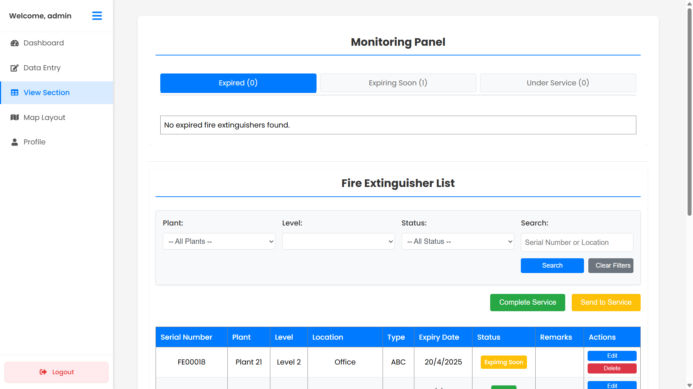
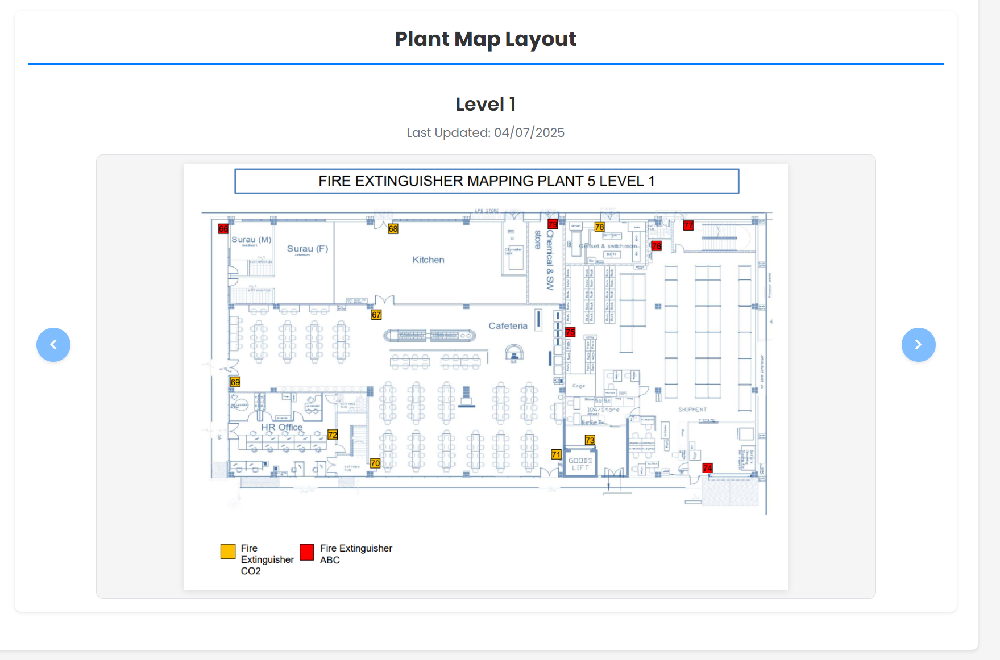
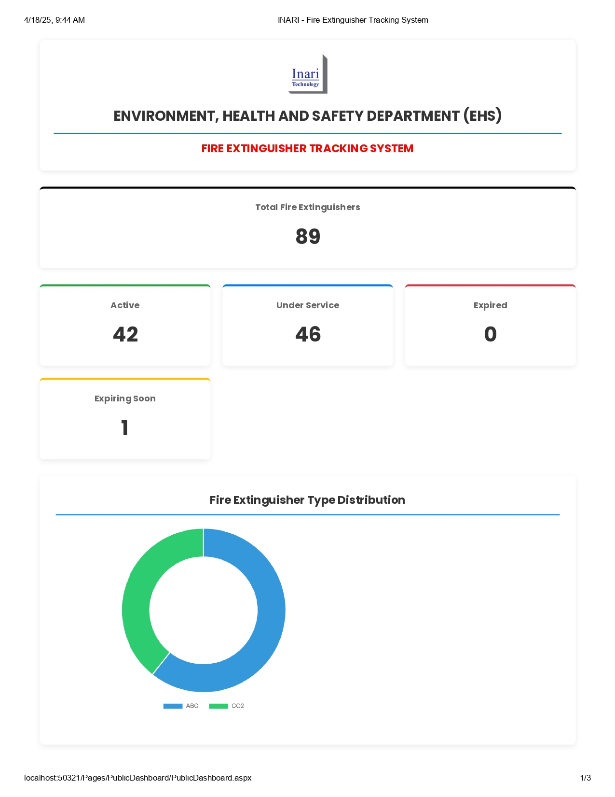
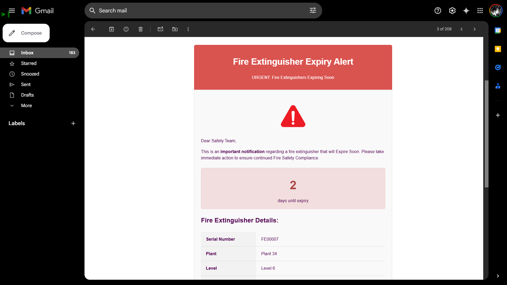

# 🧯 Fire Extinguisher Tracking System (FETS)

*FETS main system interface showing fire extinguisher tracking dashboard*

## 📖 Project Description
The Fire Extinguisher Tracking System (FETS) is a comprehensive web-based solution designed to help organizations effectively manage and monitor fire extinguishers across multiple facilities. The system enables tracking of extinguisher locations, expiry dates, service history, and inspection status, ensuring compliance with safety regulations and helping prevent potential safety risks.

Key capabilities include:
- Centralized tracking of fire extinguisher inventory across multiple plants/facilities
- Automated monitoring of extinguisher expiry dates and service intervals
- Visual map-based interface for locating extinguishers within facilities
- Email notification system for alerting staff about expiring or out-of-service equipment
- Role-based access control (administrators vs. regular users)
- Comprehensive reporting and data export functionality

## 🚀 Setup Instructions

### Prerequisites
- Windows Server or Windows 10/11
- .NET Framework 4.8
- Microsoft SQL Server 2019 or later
- IIS 7.0 or later
- SMTP server access for email notifications

### Database Setup
1. Open SQL Server Management Studio or similar tool
2. Connect to your database server
3. Execute the SQL scripts in the following order:
   - `DATABASE/Schema.sql` - Creates the database structure
   - `DATABASE/DB_Updates.sql` - Contains any updates to the schema (optional)

### Application Setup
1. Clone this repository to your local environment
2. Open `FireExtinguisherTrackingSystem.sln` in Visual Studio
3. Restore NuGet packages (right-click on the solution and select "Restore NuGet Packages")
4. Configure database connection:
   - Copy `Web.config.example` to `Web.config`
   - Update the connection string in `Web.config` to point to your SQL Server instance
   - Update SMTP settings for email notifications
5. Build the solution (Build > Build Solution)
6. Deploy to IIS:
   - In Visual Studio: Right-click project > Publish > Select IIS as target
   - Or manually: Copy built files to IIS web directory and configure as an application

### Email Notification Setup
1. Configure your SMTP settings in the Web.config file:
   ```xml
   <system.net>
     <mailSettings>
       <smtp from="your-email@example.com">
         <network host="smtp.example.com" port="587"
           userName="your-email@example.com" password="your-password"
           enableSsl="true" />
       </smtp>
     </mailSettings>
   </system.net>
   ```
2. Customize email templates in the `EmailTemplates` directory

## 🛠️ Dependencies & Tools

### Core Framework
- ASP.NET Web Forms (.NET Framework 4.8)
- Microsoft SQL Server

### Libraries
- MailKit 4.10.0 - Email functionality
- MimeKit 4.10.0 - MIME message formatting
- BouncyCastle.Cryptography 2.5.1 - Security and encryption
- System.Memory 4.6.2
- System.Threading.Tasks.Extensions 4.6.2
- System.Formats.Asn1 9.0.3
- System.Runtime.CompilerServices.Unsafe 6.1.1
- System.Buffers 4.6.1

### Client-Side
- HTML5 / CSS3
- JavaScript
- jQuery 3.7.1

## 📱 Usage Guide

### User Roles
- **Administrator**: Full access to all plants, ability to add/modify users, manage plant configurations
- **Regular User**: Access limited to assigned plant, can manage fire extinguishers within their facility

### Key Features
1. **Dashboard View**: Overview of all fire extinguishers with status indicators
   - Green: Active extinguishers
   - Yellow: Extinguishers expiring soon (within 60 days)
   - Red: Expired extinguishers
   - Blue: Extinguishers under service

2. **Data Entry**: Add new fire extinguishers with details including:
   - Serial Number
   - Area Code
   - Plant and Level location
   - Type (CO2, ABC, etc.)
   - Expiry Date
   - Additional remarks

3. **View Section**: Monitor extinguisher status with filtering capabilities
   - Send extinguishers to service when needed
   - Complete service process with new expiry dates
   - Export data to Excel for reporting

   
   *Fire extinguisher management interface with monitoring and service capabilities*

4. **View Map**: Detailed interactive view of fire extinguisher locations
   - Zoom and pan controls for map navigation
   - Clickable extinguisher markers with detailed information
   - Search functionality to find specific extinguishers
   
   
   *Interactive map view showing fire extinguisher positions with detailed information*

5. **Map Layout**: Visual representation of extinguisher locations within facilities
   - Interactive map with zoom and pan controls
   - Markers showing exact extinguisher positions
   - Quick search and filter functionality
   
   
   *Sample facility layout for locating fire extinguishers*

6. **Public Dashboard**: At-a-glance overview accessible to all staff
   - Simplified view of extinguisher status across facilities
   - No login required for basic monitoring
   - Quick access to critical safety information
   
   
   *Public dashboard interface showing extinguisher status distribution and quick access controls*

### Action Buttons
The main action buttons are arranged in this order:
1. **Send to Service**: Select and send extinguishers for maintenance
2. **Complete Service**: Update extinguishers that have completed servicing
3. **Export to Excel**: Generate reports for compliance and documentation

### Email Notifications
The system automatically sends notifications for extinguishers requiring attention:


*Email notification template for expired or soon-to-expire fire extinguishers*

## 📋 Project Structure
The application follows a standard ASP.NET Web Forms structure:
- `Pages/`: Contains all application pages organized by functionality
- `Assets/`: CSS styles and frontend resources
- `Scripts/`: JavaScript files including jQuery
- `Uploads/`: Stores user-uploaded files like map images
- `EmailTemplates/`: Email notification templates
- `DATABASE/`: SQL scripts for database setup and updates

## 🆘 Support
For technical support or feature requests, contact your system administrator. If you encounter bugs or have suggestions for improvements, please create an issue in this repository.

## 🔒 Security Notes
- Default admin login: Username: `admin`, Password: `admin123`
- It is strongly recommended to change the default password after installation
- The system uses SHA-256 hashing for password storage