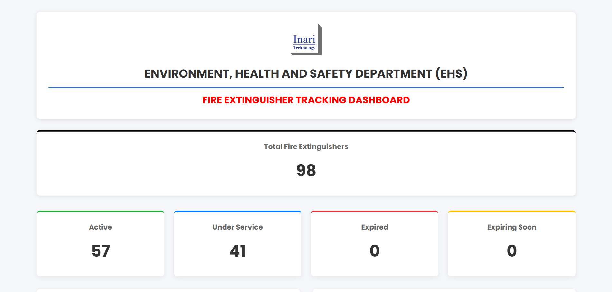
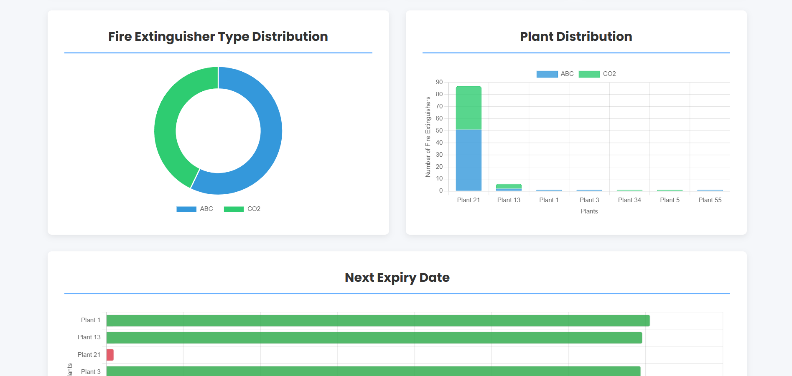
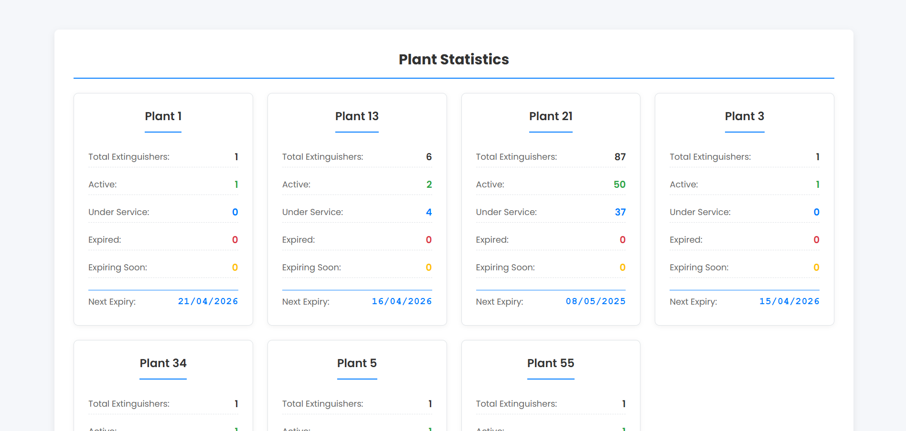

# 🧯 Fire Extinguisher Tracking System (FETS)

A comprehensive system for tracking, managing, and maintaining fire extinguishers across multiple plants and locations.

## 📋 Features

- **Multi-Plant Support** - Manage extinguishers across different plants and levels
- **Expiration Tracking** - Monitor expiration dates and schedule services
- **Visual Mapping** - View extinguisher locations on uploaded floor plans
- **Service Management** - Track service history and replacement status
- **Email Notifications** - Automated reminders for upcoming expirations
- **User Management** - Role-based access control for different permission levels
- **Activity Logs** - Comprehensive audit trail of all system activities

## 📸 Screenshots

### Dashboard



*Main dashboard showing fire extinguisher status overview*

## 🛠️ Technical Stack

- **Database**: Microsoft SQL Server
- **Frontend**: ASP.NET
- **Backend**: ASP.NET

## 🔧 Database Setup

### Prerequisites

- Microsoft SQL Server 2019 or newer
- SQL Server Management Studio (SSMS) or equivalent SQL client

### Installation Steps

1. Open SQL Server Management Studio and connect to your SQL Server instance
2. Open the `DATABASE/FETS_DATABASE.sql` script file
3. Execute the script to create the database and all required tables
4. Verify the database has been created with all tables:
   - ActivityLogs
   - EmailRecipients
   - FireExtinguishers
   - FireExtinguisherTypes
   - Levels
   - MapImages
   - Plants
   - ServiceReminders
   - Status
   - Users

### Initial Configuration

After installing the database:

1. Add initial plant locations through the application or direct SQL
2. Create admin user(s) to access the system
3. Set up email notification recipients for service reminders
4. Define fire extinguisher types and status codes

Example SQL for basic setup:

```sql
-- Add plants
INSERT INTO Plants (PlantName) VALUES ('Main Plant'), ('Secondary Plant');

-- Add levels for plants
INSERT INTO Levels (PlantID, LevelName) 
VALUES (1, 'Floor 1'), (1, 'Floor 2'), (2, 'Ground Floor');

-- Add extinguisher types
INSERT INTO FireExtinguisherTypes (TypeName)
VALUES ('CO2'), ('Dry Chemical'), ('Foam'), ('Water');

-- Add status types with color codes
INSERT INTO Status (StatusName, ColorCode)
VALUES 
('Active', '#00FF00'),
('Expired', '#FF0000'),
('In Service', '#FFA500'),
('Replaced', '#0000FF');
```

## 👥 User Roles

- **Administrator**: Full system access
- **Plant Manager**: Access to manage specific plant locations
- **Technician**: Limited access for service updates
- **Viewer**: Read-only access to system data

## 📊 Database Schema

The system uses the following main tables:

- **Plants**: Defines different plant locations
- **Levels**: Floors or areas within each plant
- **FireExtinguishers**: Core inventory of all extinguishers
- **Status**: Possible states of extinguishers
- **ServiceReminders**: Tracks service schedules and reminders
- **Users**: System users with role-based permissions

## 📅 Maintenance Schedule

Recommended maintenance cycle:

- Daily: Check for expired extinguishers
- Weekly: Review upcoming service needs
- Monthly: Audit extinguisher locations and statuses
- Quarterly: Update floor plans and location maps

